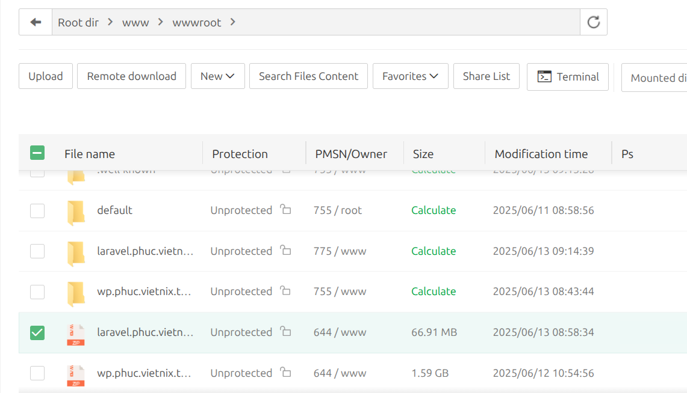
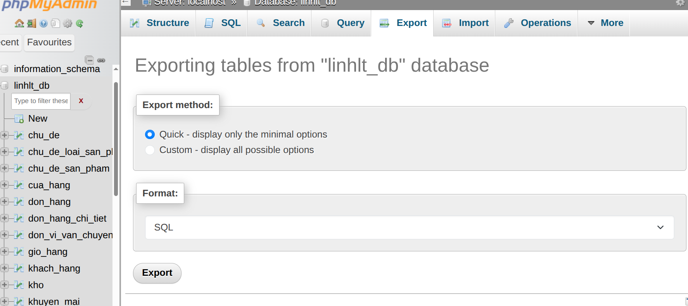
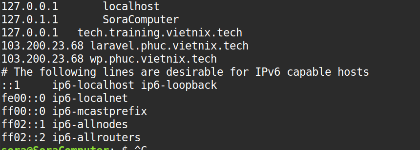
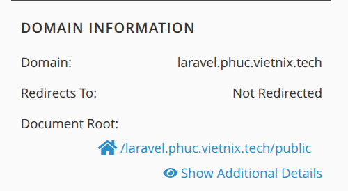
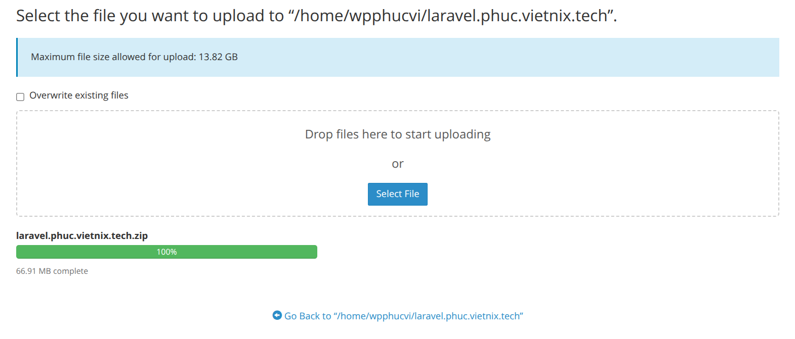
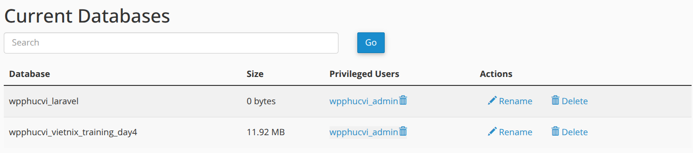
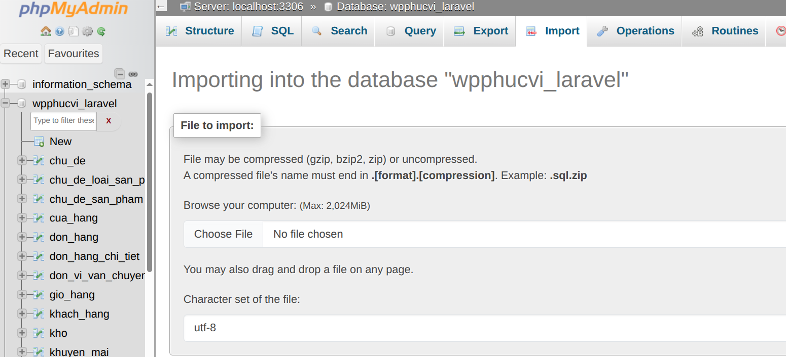
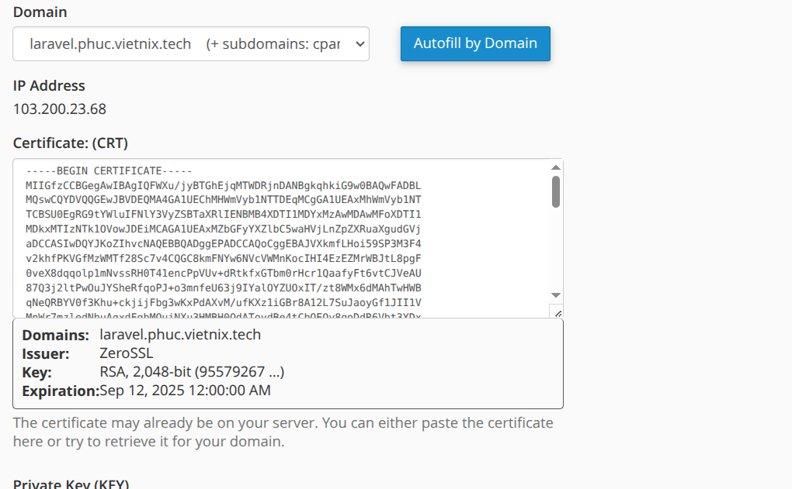
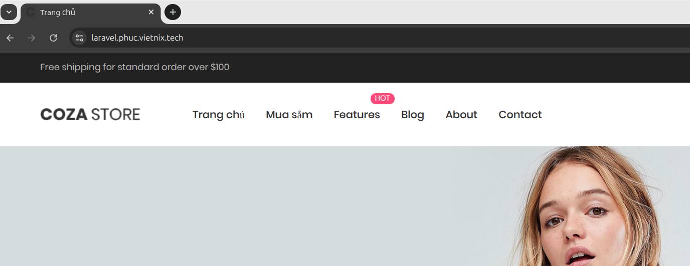

# 🚀 Deploy Laravel lên cPanel với Domain Ảo và SSL ZeroSSL

## 📁 1. Nén và tải mã nguồn Laravel từ AaPanel

- Truy cập **AaPanel**.
- Vào thư mục chứa project Laravel.
- Chọn toàn bộ source code và nén thành file `.zip`.

- Tải file `.zip` về máy tính cá nhân.

---

## 🛢️ 2. Export database từ phpMyAdmin

- Mở **phpMyAdmin** trên AaPanel.
- Chọn database Laravel → tab **Export** → chọn định dạng SQL → `Export`.

---

## 🌐 3. Cấu hình domain ảo trong file hosts

- Mở file `hosts` và thêm dòng 103.200.23.68 laravel.phuc.vietnix.tech

  
  

## 🌿 4. Tạo subdomain trên cPanel và trỏ đúng thư mục

- Truy cập vào cpanel và tạo 1 subdomain laravel.phuc.vietnix.tech sau đó trỏ tới thư mục laravel.phuc.vietnix.tech/public

## ⬆️ 5. Upload source code lên server

- Vào **File Manager** trong cPanel.
- Truy cập thư mục `laravel.phuc.vietnix.tech`.
- Upload file `.zip` Laravel.

## 🧩 6. Tạo database mới trên cPanel

- Vào **MySQL Databases**.
- Tạo:
  - Một database
  - Một database user
  - Gán user vào database

## 💾 7. Import file `.sql` vào phpMyAdmin

- Truy cập phpMyAdmin từ cPanel.
- Chọn database mới.
- Tab **Import** → Chọn file `.sql` đã tải từ trước.

---
## 🔒 8. Cài SSL từ ZeroSSL

- Tải về file `.crt`, `.key`, `.ca-bundle` từ ZeroSSL.
- Truy cập **SSL/TLS** > **Manage SSL Sites**.
- Chọn domain `laravel.phuc.vietnix.tech`.
- Dán nội dung tương ứng:
- Certificate (CRT)
- Private Key (KEY)
- Certificate Authority Bundle (CABUNDLE)

---

## ✅ 9. Kiểm tra website

- Mở trình duyệt và truy cập:
- https://laravel.phuc.vietnix.tech
- 

---

