# Hướng Dẫn Cài Đặt WordPress và Laravel trên CyberPanel

## I. Cài Đặt CyberPanel

### 1. Cập nhật các gói cài đặt

Trước khi cài đặt CyberPanel, bạn cần cập nhật các gói phần mềm trên hệ thống.

```bash
sudo yum check-update
sudo yum update
```
🔄

### 2. Cài Đặt CyberPanel

Chạy lệnh sau để cài đặt CyberPanel:

```bash
sh <(curl https://cyberpanel.net/install.sh || wget -O - https://cyberpanel.net/install.sh)
```
⚙️

### 3. Các Tuỳ Chọn khi Cài Đặt

Khi cài đặt CyberPanel, bạn sẽ được yêu cầu chọn các tuỳ chọn sau:

- **Cài đặt CyberPanel**: Chọn `y` để cài đặt.
  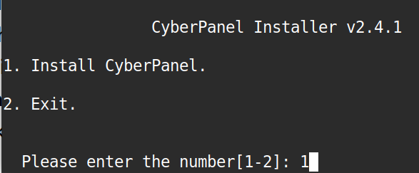 { width=250 }

- **Cài đặt với OpenLiteSpeed**: Chọn `y`.
  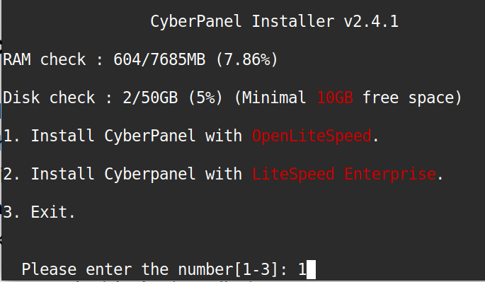 { width=250 }

- **Full Service**: Chọn `y` (mặc định).
  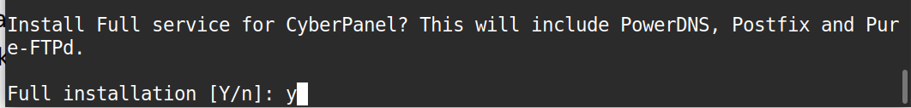 { width=250 }

- **Remote MySQL**: Chọn `n` (mặc định).
  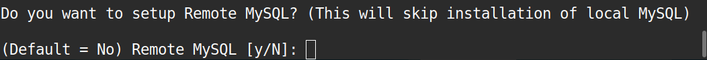 { width=250 }

- **Chọn Phiên bản CyberPanel**: Chọn `Latest Version` (mặc định).
  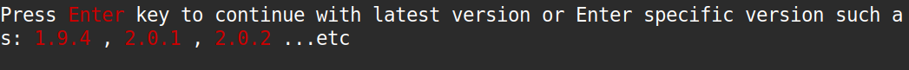 { width=250 }

- **Cấu hình mật khẩu**: Đặt mật khẩu cho tài khoản `admin` (mặc định là “1234567”).

- **Memcached**: Chọn `y` (mặc định).
  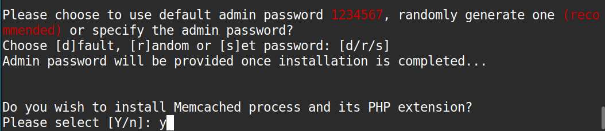 { width=250 }

- **Redis**: Chọn `y` (mặc định).
  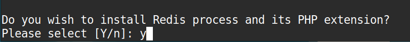 { width=250 }

- **Watchdog**: Chọn `y` (mặc định).
  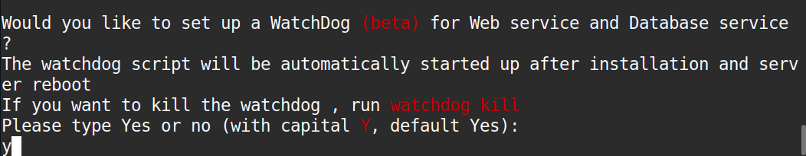 { width=250 }

Sau khoảng 15 phút, quá trình cài đặt sẽ hoàn tất và bạn sẽ nhận được thông báo thành công:

```bash
###################################################################
                CyberPanel Successfully Installed                  

                Current Disk usage : 8/50GB (17%)                        

                Current RAM  usage : 1232/7685MB (16.03%)                         

                Installation time  : 0 hrs 18 min 0 sec                 

                Visit: https://14.225.254.47:8090                     
                Panel username: admin                              
                Panel password: vXwyIQQXFePw7CN1                        

             Run cyberpanel help to get FAQ info
             Run cyberpanel upgrade to upgrade it to latest version.
             Run cyberpanel utility to access some handy tools .

              Website : https://www.cyberpanel.net                 
              Forums  : https://forums.cyberpanel.net              
              Wikipage: https://docs.cyberpanel.net                
              Docs    : https://cyberpanel.net/docs/               

            Enjoy your accelerated Internet by                  
                CyberPanel & OpenLiteSpeed 				                     
###################################################################
```
🖥️

- Truy cập trang quản trị: `https://14.225.254.47:8090`
  Đăng nhập với tài khoản `admin` và mật khẩu đã cài đặt.

## II. Up Source Code WordPress lên Hosting CyberPanel

### 1. Tạo Một Trang Web Trong CyberPanel

Truy cập vào CyberPanel và tạo một trang web mới.

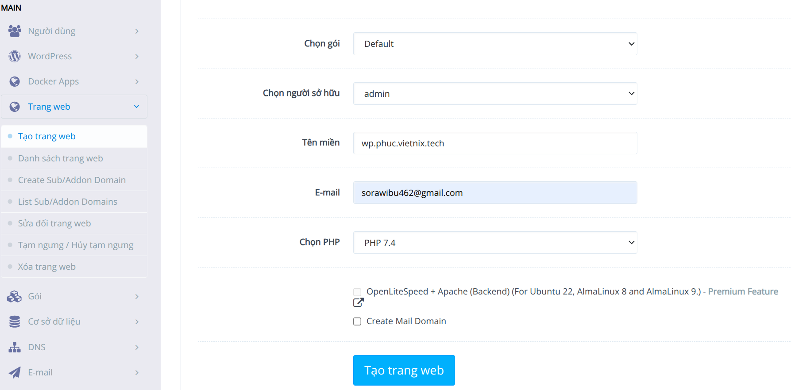 ➕

### 2. Quản Lý Trang Web và Lấy SSL

- Truy cập vào **File Manager** để tải lên mã nguồn WordPress.

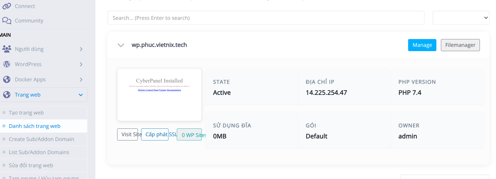 📂

### 3. Upload Mã Nguồn và Giải Nén

- Upload mã nguồn WordPress và giải nén tệp lên hosting.

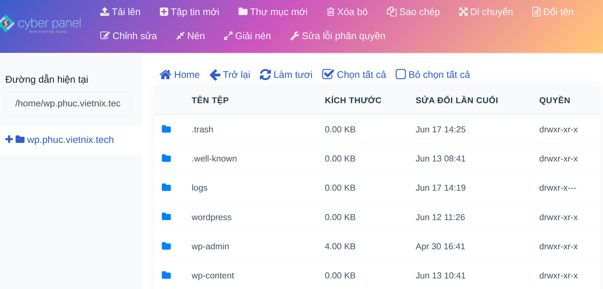 📤

### 4. Cấu Hình PHP

- Cập nhật tham số `upload_max_filesize` và `post_max_size` trong PHP lên 10MB để hỗ trợ việc upload tệp lớn.
  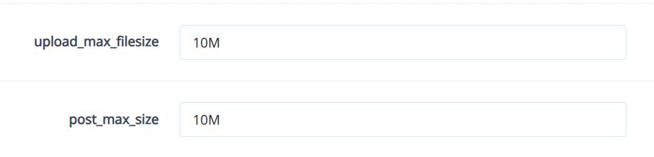 ⚙️

### 5. Import Database Thông Qua PHPMyAdmin

- Truy cập vào **PHPMyAdmin** và import cơ sở dữ liệu WordPress.

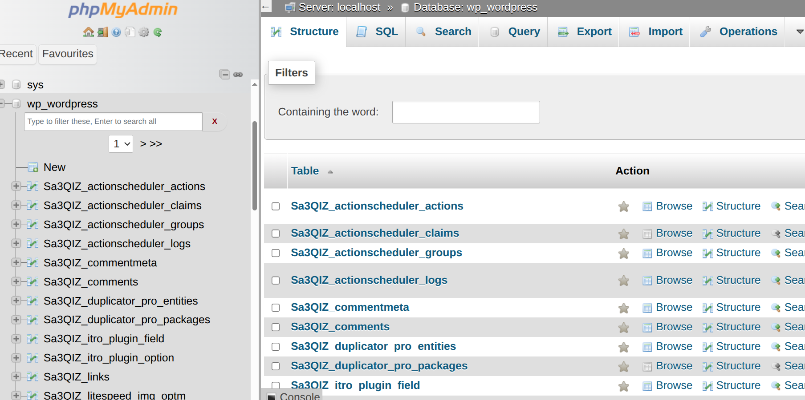 🗄️

## III. Up Source Code Laravel lên Hosting CyberPanel

### 1. Tạo Trang Web Với PHP 8.2

Tạo một trang web mới với PHP 8.2 (Laravel yêu cầu PHP 8.0 trở lên).

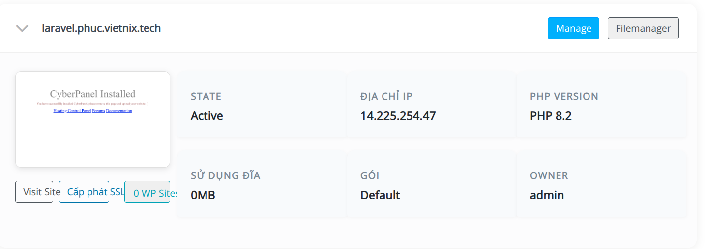 📑

### 2. Upload Mã Nguồn Laravel và Import Database

- Upload mã nguồn Laravel và giải nén vào **File Manager**.
- Import cơ sở dữ liệu Laravel thông qua **PHPMyAdmin**.

### 3. Cấu Hình `.env` File

Mở và chỉnh sửa file `.env` của Laravel để cấu hình kết nối cơ sở dữ liệu:

```bash
DB_CONNECTION=mysql
DB_HOST=127.0.0.1
DB_PORT=3306
DB_DATABASE=lara_laravel
DB_USERNAME=lara_admin
DB_PASSWORD=Phuc27012004
```
⚙️

### 4. Sửa Vhost

Cấu hình **Vhost** cho Laravel trong phần **Manage Website**:

```bash
docRoot                   $VH_ROOT/public
```

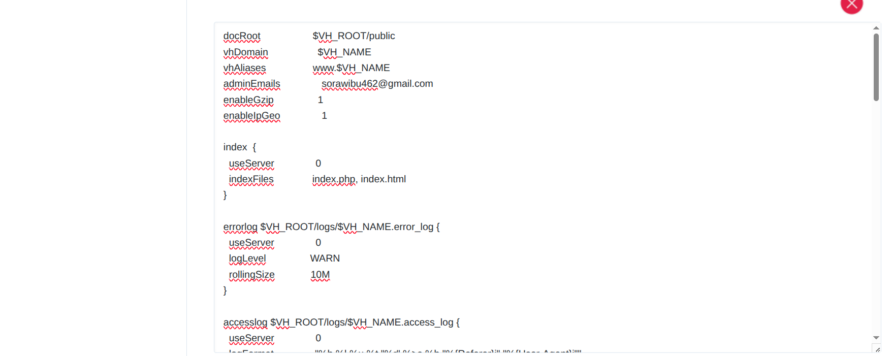 🖥️

---
